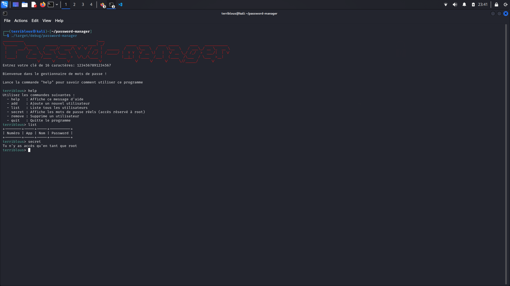

<p align="center">
    
    <h1 align="center">Password Manager</h1>
    <h4 align="center">
      Gérez vos mots de passe plus simplement
    </h4>
    <div align="center">
        
        
        
        
    </div>
  <br>
</p>



Le Password Manager est une application en Rust conçue pour fournir une solution pour gérer vos mots de passe. Vos données sont cryptées et vous êtes les seuls à y avoir accès depuis le superutilisateur(**root**).

## Fonctionnalités

- Vous avez la possibilité d'**ajouter**, de **supprimer** et de **lister** les données.
- La visibilité des mots de passe décryptés n'est possible qu'en `root`.
- Vos mots de passe sont cryptées `AES encryption`.
- Sauvegarde sous forme de fichier `.csv`.

⚠️ Vous devez vous souvenir de la clé que vous utilisez.

## Installation

Tu dois installer [Rust](https://www.rust-lang.org/fr/tools/install).

## Utilisation
Compilation:
```
cargo build
```

Lancement du programme:
```
./target/debug/password-manager
```
## Help
```
Utilisez les commandes suivantes :
  - help   : Affiche ce message d'aide
  - add    : Ajoute un nouvel utilisateur
  - list   : Liste tous les utilisateurs
  - secret : Affiche les mots de passe réels (accès réservé à root)
  - remove : Supprime un utilisateur
  - quit   : Quitte le programme
```
